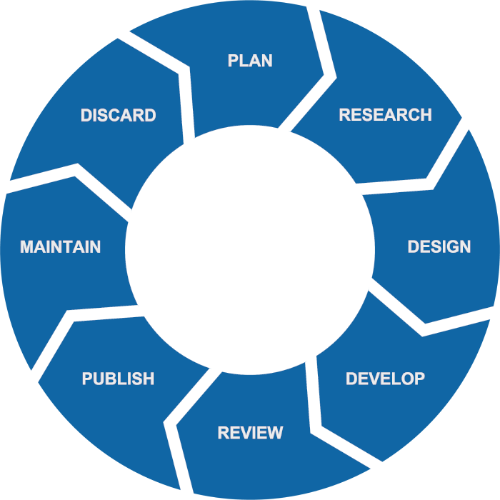

## What is technical communication?

[Does exactly what it says on the tin⎹](#does-exactly-what-it-says-on-the-tin) [Projects of many stages⎹](#projects-of-many-stages) [What disciplines are there in tech comm?⎹](#what-disciplines-are-there-in-tech-comm) [Technical writer – how important?](#technical-writer--how-important)

### Does exactly what it says on the tin

Especially if the tin features meal prep instructions!  

[ITCQF](https://itcqf.org/) describes technical communication as a field that  

> ❝*[...] combines a range of disciplines that work together to efficiently transfer specialized information to those who need it to accomplish a defined task or goal.[^1]*❞

A translator needn't be tutored on *the functions of language* and on how information is transferred. In short: information doesn't have to be written; and yet, people by default make assumptions based on [*that which is seen*](https://en.wikipedia.org/wiki/Parable_of_the_broken_window), and not *that which isn't.* Hence, even though tech comm professionals communicate *a lot* outside of writing, their job is mostly associated with creating documentation and document-related content.  

Documentation, that is *documents*, as in: instruction manuals, guidelines, specifications, training materials, and many a similar other.  

Ideally, documentation should exist within the following information lifecycle[^2], separately from the product itself:  

  

This representation of an infinite cycle makes much sense in the context of *information*, which is naturally subject to constant changes: to being abandoned and then retrieved; to recycling and redefining; to becoming outdated, revised – and then reupdated.  

As mentioned, these changes are separate from changes in the product, and at that they are more volatile. A small but sudden change in the product won't throw the development team off, but it might have a major impact on documentation. Let's say that software developers add a small feature to an app, fix a bug, and optimize the code. The customers will probably download the update automatically, and the devs' work will practically go unnoticed – but the tech writers won't hide so easily! Apart from delivering timely *release notes*, they must update documentation in all the right places, and for every publishing channel and format. Now think how tricky it gets if the company prints the docs too!

Hence, content creators plan revision strategies, track changes, standardize versioning, set up delivery channels, utilize [single-sourcing](../../04-learning-the-basics/4-standards-and-practices/index.md/#single-sourcing), and regularly consult engineers to stay on top of updates. Things can get hectic!

To adapt, technical communicators should always be ready to respond to any changes that may come up. The key is to be flexible, sometimes more so than to rigidly follow tasks as specified at different project stages.  

The stages, though, are no less important.  

### Projects of many stages

Every project begins with **planning:** drawing up a list of steps/tasks in the project; estimating the time, cost, and effort required for completion.

Then the project moves onto **research and design** stage, where requirements are specified, tools and publishing routes selected, and where the target audience, the type, and the scope of documents, as well as risks and constraints are identified. A result of this analysis are various design choices: to create documentation for this or that type of audience, via this or that publishing route, in this or that many formats and copies, with these or those tools, and with content of this or that scope, with a specific level of technicality, number of visual elements, and so on.  

Then, documentation is **developed**, **reviewed** (or [tested](../../04-learning-the-basics/3-content-design/index.md/#testing)), and finally **published** – but technical communicators' role doesn't end there.  

Documentation must be **maintained**, to account for the possible changes, which – especially in the case of software and [agile](../../09-glossary/index.md/#a) development – happen often and way past the initial product release. Even physical products require constant customer support and quality control, and these also involve documentation.  

When documentation is no longer relevant due to major updates or discontinuation of a product, the content is discarded and the whole cycle repeats. There are always new goals, new technologies, and new projects ahead.  

To paraphrase [Benjamin Franklin](https://constitutioncenter.org/blog/benjamin-franklins-last-great-quote-and-the-constitution):  

> ❝*[...] in this world, nothing is certain except death and taxes*❞

> – and documents.  

### What disciplines are there in tech comm?

Apart from technical writing, there are other disciplines within tech comm.  

* **Technical editing** consists in proofreading and editing documents to ensure linguistic and technical correctness, and to evaluate documents based on how well they fit the specified criteria and meet the project's objectives.  

* **Graphic design** in tech comm involves various tasks concerning visual media: creating and editing images, diagrams, infographics, website stylesheets, and more.  

* **Information architecture** is the structural design of documentation; it focuses on organizing the content in such a way as to facilitate users' interaction with the documents and to ensure efficient communication in all directions.  

* **User experience (UX)** is about intuitive design; it concerns stylistic and functional aspects that influence users' experience. Those include the interface, the organization of information, or anything else that contributes to *usability* of documentation, i.e., the degree to which interaction with the document effectively serves the user's purpose.  

* **Technical training** involves designing and creating educational materials, carrying out training sessions, planning curriculums, and performing a variety of tasks for didactic purposes. As per the name, technical training focuses on *technical* topics.  

* **Technical translation** will be your forte if it ever crosses your tech writing path – and it just might. In tech comm, translation-related tasks may involve preparing documents for localization or cooperating with translators to design "translation-friendly" content. Imagine, for example, all the layout issues that come up when you localize into languages that have right-to-left writing systems or use ideographs instead of alphabets.  

### Technical writer – how important?

Technical writers are as important as the content they create – and good documentation is invaluable. Of course, some would disagree. After all, products work fine without useless manuals that nobody reads. I'll do you one better: products work fine without marketing, quality assurance, customer support...  

Business is not about selling products that *just* work, nor is technology about strapping sticks together and calling it toolmaking. Respectable companies know that, and they realize how much value technical writers bring to an organization.  

First of all, technical writers aid end users. In so doing, they relieve customer service and reduce costs of product support. They also help users avoid risks, with instructions that follow industry-approved safety standards.  

Secondly, writers help with marketing. Some of the content that tech writers produce can be used in advertising or as a demo to give customers an idea of how the product works. Well-written documents indicate good organization too, which may be an incentive for investors.  

Finally, technical writers participate in product development. They are often the first beta-testers; they can make useful comments and report bugs. They prepare training materials, document processes, and archive all that data for future reference. They help to standardize procedures and make their colleague's work more efficient.  

For more examples, click on the banner below.  

Documentation is a lot like translation: people usually notice it when it's terrible or when it's not there at all. Professionals work half their life on a craft in which an average Joe claims proficiency after taking two courses and watching a season of *Friends* without subtitles. Over the years, said professionals develop skills most people haven't heard of, and eventually they get paid good money: either by someone desperate for help, someone who knows pros will do it better, or someone who doesn't have the time to do it themselves any more.  

Sounds familiar, right? Only that this time there's technology. There's coding. There's graphic design. There are passionate people who know that *[innovation happens at intersections](https://www.ted.com/talks/emilie_wapnick_why_some_of_us_don_t_have_one_true_calling/)*. You might be in for a treat!  

[^1]: [ITCQF Syllabus](https://itcqf.org/wp-content/uploads/2020/06/ITCQF_Syllabus_v2_0Jun2020.pdf) (ver. 2.0, 2020), p. 7.
[^2]: Again, as suggested by [ITCQF](https://itcqf.org/wp-content/uploads/2020/06/ITCQF_Syllabus_v2_0Jun2020.pdf); ibid, pp. 8–9.

---

* Footnotes will be placed here.
{:footnotes}  

---

*Next section: [What does a technical writer do?](../2-what-does-a-technical-writer-do/)*