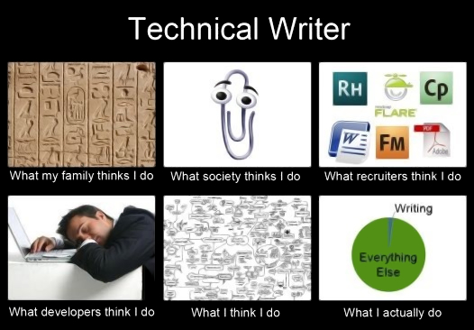

## What does a technical writer do?

[Isn't it ironic?⎹](#isnt-it-ironic) [High- and low-level operations⎹](#high--and-low-level-operations) [The common denominator⎹](#the-common-denominator) [Work environment](#work-environment)

### Isn't it ironic?

You would probably expect a technical writer to... write, or at least to have most of their tasks involve writing. Here comes the surprise. In reality, much of a technical writer's work may not consist in writing at all. It can be editing texts. It can be gathering and synthesizing data. It can be maintaining and reusing content. It can even be writing some code – but not necessarily writing in human-readable language. This, of course, will differ from job to job, often considerably. Unfortunately, the obscurity is here to stay until everyone agrees on what technical writing actually is – and that doesn't seem to be coming anytime soon.  

  
*Pretty much this.* | Image source: [Technical Writer in China](https://twchina.wordpress.com/technical-writers-who-are-they/)  

### High- and low-level operations

The *technicality* involved in a technical writer's job could be represented by a hypothetical vertical scale of *low-* and *high-level* operations.

A lower-level operation would be any operation that concerns specific elements of a system; one that requires deeper technical knowledge and direct intervention in the product. This could be, for example, implementing something in software's code; especially some functionality, automation, or anything deeper in terms of logic than mere presentational aspects.

A higher-level operation, on the other hand, would be any operation that concerns general functioning of a system; any operation that requires little technical knowledge. For a technical writer this could be, for instance, writing a description of software for end-users, or delivering release notes for a new product update.  

On this spectrum, different technical writing posts can vary greatly in responsibilities. Some tech writers might be part of a [Scrum](../../09-glossary/index.md/#s) team, for example; as such, on certain days they may contribute to the code on par with other developers, while for the rest of the week they will deal mostly with documents. Other technical writers' work may revolve around testing, graphic design, [UX writing](../../04-learning-the-basics/3-content-design/index.md/#user-experience), managing content in [publishing software](../../05-tools/2-content-management-and-publishing/index.md), taking screenshots, or editing videos, among other things. Tech comm specialists may just as well deal only with high-level operations, such as creating tutorials and quick start guides for non-technical end users.  

### The common denominator

No matter how much jobs in the field can vary, the core of technical writing remains the same: to act as an intermediary between technical and non-technical individuals and as a communicator within each of these groups.

  

In this communication model, creating, editing, maintaining, testing, and analyzing the content is either the result, the cause, or the means – and most likely all of these, at different points in the project life cycle.  

Thus, there are writers who take lower-level, technical input, and transform it into easy-to-understand output for non-technical users: manuals, tutorials, and the like. There are also writers who create content for developers and engineers: specifications, implementation guides, or [API](../../09-glossary/index.md/#a) documents, among others. Finally, there are writers who create content that helps with management, efficiency, and safety within an organization: rules, guidelines, policies, and process documentation.  

In principle, technical writing strives for efficiency, clarity, facilitation, and standardization; that is, the goal is to instruct, explain, clarify, and organize. Subject-wise, technical docs typically concern products, systems, tools, and processes; they can also serve training purposes. Technical writers target a variety of audiences: from engineers through managers to non-technical users. The subject matter and the practical focus are primarly what sets this profession apart from other writing disciplines, such as:  

* Creative writing[^1], concentrated on aesthetics and entertainment value.
* Marketing writing and copywriting, focused around sales and business purposes.
* Academic writing, intended for presenting ideas, synthesizing knowledge, and engaging in scholarly discussions.
* UX writing, for building intuitive interfaces.

Of course, certain tasks within these disciplines may overlap, but their character, goals, and workflows are different enough in the long run to tell one type of writing from another.

Technical writers must know how to look for information, but they should have strong social skills too. Whereas scholars and creatives may get by on solitary research, tech writers will usually need direct human input for their docs.  

### Work environment

If you've got tired with relative instability in your field, you can take solace in that tech writers usually work for one employer at a time, full-time or as B2B contractors.  

Remote work is also very common, although this will vary depending on the company and their product. Software documentation pairs with home office quite well, but for hardware you might need to be present on site and get hands-on experience with what you're writing about.  

[^1]: This is not to say that technical writing *isn't* or *can't be* creative.

---

* Footnotes will be placed here.
{:footnotes}  

---

*Next topic: [What are the career prospects](../3-what-are-the-career-prospects/)*