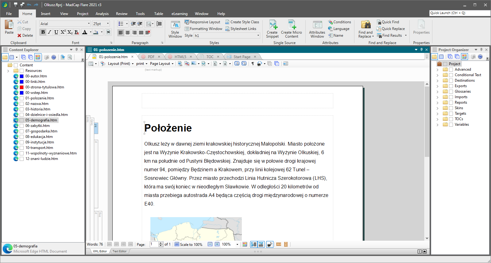

## Content management and publishing

[Content Management Systems⎹](#content-management-systems) [Help Authoring Tools⎹](#help-authoring-tools) [Static site generators](#static-site-generators)

### Content Management Systems

Content management systems (CMS) are software solutions for managing digital content. CMS typically allow users to manage content at a document level. They provide writers with a uniform platform to handle content all in one place, from creation to deployment.  

Closely related are Component content management systems (CCMS). These, in turn, allow for managing content at a component level. The difference is thus in how specific you can be with the elements of content you address in your management system.

Modern CMS and CCMS are essentially self-contained software environments where you can perform most project-related tasks: from creating and managing content to editing and reviewing documents, exchanging comments with other contributors, and publishing your final outputs.

A very popular CMS (or CCMS, actually) among technical writers is [Heretto](https://heretto.com/). Heretto has in-built functionalities for handling [single sourcing](../../04-learning-the-basics/4-standards-and-practices/index.md/#single-sourcing) and [reuse](../../04-learning-the-basics/4-standards-and-practices/index.md/#reuse), among other things.

Atlassian's [Confluence](https://www.atlassian.com/software/confluence), a web-based corporate wiki, is another tool that can be successfully used as a CMS. Although technically an ECM (Enterprise Content Management) and collaboration software, it's well-organized and efficient enough for document management and publishing. If you decide to study technical communication at [Vistula](../../06-education/5-degrees/index.md/#technical-communication-at-university), you will have access to Confluence for a whole year – more than enough to get an idea of what working in a CMS feels like.

### Help Authoring Tools

Help Authoring Tools (HAT) are a type of content management systems designed specifically for creating and publishing documentation. Perhaps the most popular HAT on the market right now is [MadCap Flare](https://www.madcapsoftware.com/products/flare/).  

HATs are very useful for big documentation projects, especially when you publish online docs along with printable formats (such as PDF). In general, HATs handle [single sourcing](../../04-learning-the-basics/4-standards-and-practices/index.md/#single-sourcing) and [reuse](../../04-learning-the-basics/4-standards-and-practices/index.md/#reuse) very well, with advanced transformation scripts, variables, snippets, and topic-based architecture (for more on *topic-based* projects, see: [DITA](../../04-learning-the-basics/4-standards-and-practices/index.md/#dita)). Other common functionalities include [WYSIWYG](../../05-tools/1-writing-and-text-editing/index.md/#wysiwyg)-like modes, simple image editors, spell checkers, or automatically-generated structure elements (e.g., tables of contents).

*A project edited in MadCap Flare.*

HATs' amenities come with a price, though. For companies, the cost of software licences may be well worth the gains, but for a beginner like yourself, the expense would be hardly justified. Instead of shelling out $165 for a monthly subscription of Flare, make the most out of free trials and YouTube tutorials. Then, you can apply for internships and junior positions to companies that use HATs. The real training starts once you land the job, after all!

### Static site generators

Static site generators are software tools designed for generating static HTML websites. "Static", as opposed to "dynamic", means that the content is fixed, loaded all at once, and always displayed in the same way. The website doesn't need to communicate with a database, and there is little to no interaction or customization available for the users. Limiting as it may sound, static content is just what you need for rapid deployment of simple web projects.

Unless you're a web designer, you are probably not going to set up an entire website from scratch. Working up the scructure, creating the stylesheets, writing scripts – it could take a while. Instead of reinventing the wheel, you can use a static site generator, deploy your page quickly, and focus on the content rather than low-level technicalities.

Popular static site generators include:

* [Jekyll](https://jekyllrb.com/)
* [Hugo](https://gohugo.io/)
* [Docusaurus](https://docusaurus.io/)
* [Sphinx](https://www.sphinx-doc.org/)

Jekyll is natively supported by GitHub Pages, which we will discuss later when we cover the publishing of your [Portfolio](../../07-employment/1-portfolio/index.md/#how-to-publish-your-portfolio-on-github-pages).  

Static site generators generally have a simple syntax designed towards implementation of the most common functionalities that you, the creator, could think of when deploying a page. A lot of these are simple instructions or *true/false* statements that you include in special configuration files. There are also many templates that you can apply and modify to change the look of your website.

Now, how would you know how to set up, publish, and modify a static site in the first place? Yep, you've guessed it. *Just read the [documentation](https://jekyllrb.com/docs/)!*

---

*Next topic: [Creating visual content](../3-creating-visual-content/)*
