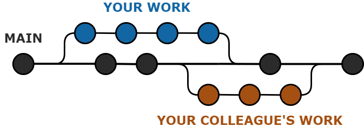
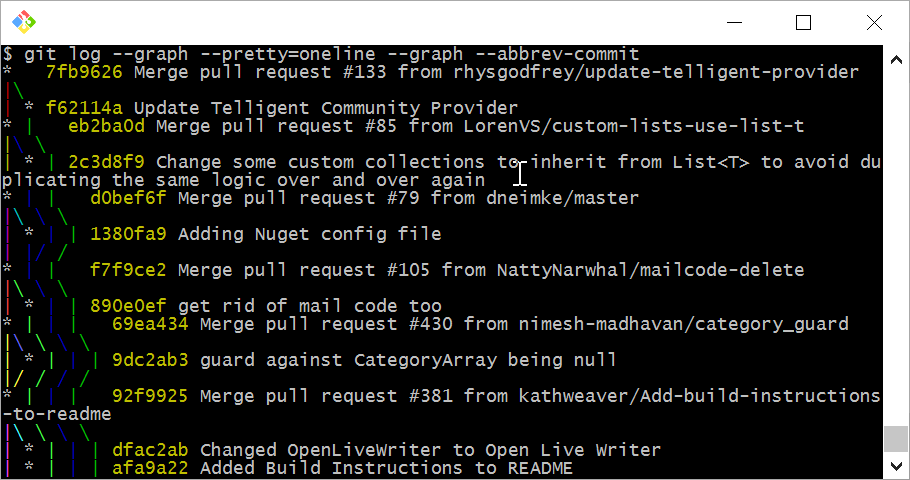
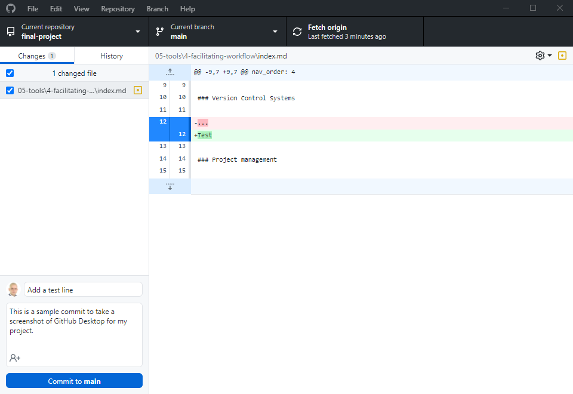
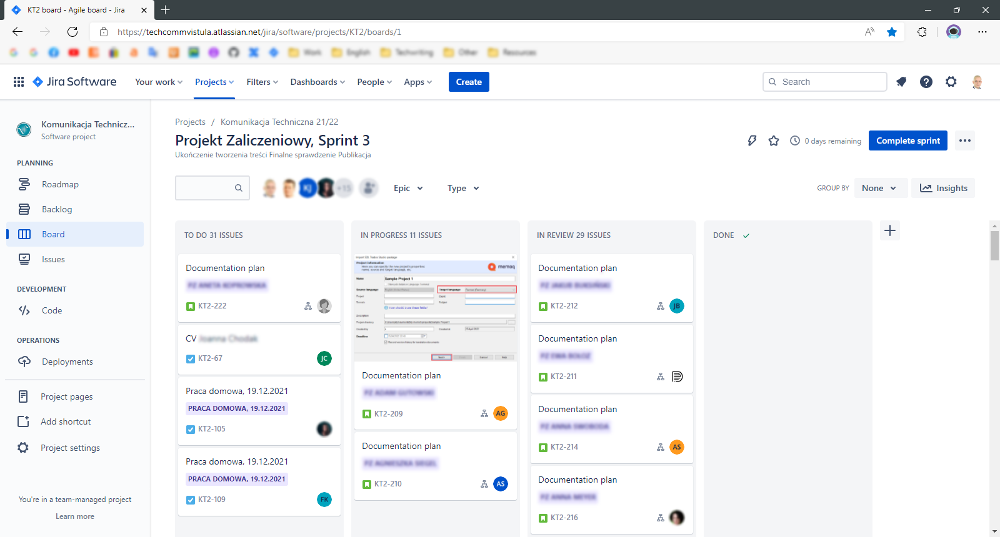

## Facilitating workflow

[Version Control System⎹](#version-control-systems) [Project management](#project-management)

### Version Control Systems

Version Control Systems (VCS) are systems designed for tracking and controlling changes in software source code. However, you can just as well use them to track changes in other types of content, such as text and images in your documents.  

VCSs provide the functionality of *branches*, i.e., developers can work independently on various aspects of the software at the same time, and then they can integrate their individual contributions. Consider the following example.

You are working on a new feature. At the same time, your colleague is working on another, unrelated feature for the same app. Then, at some point, you *commit* (send to the server) your progress and *merge* it with the main branch. Your colleague commits his changes too, but at another time; that's OK – you don't have to synchronize! You both commited to the main branch at some point, so your individual contributions are now integrated into the product. Your app has two new features!  

Now, I said you didn't have to synchronize, but it's only part of the truth. You still need to communicate! The features in our scenario were unrelated, but sometimes you and your colleagues might be working on the same part of code (or documentation), and then there can be *conflicts* between your contributions. When this happens, Git will show you and your colleague where the problem occurs. Then you can discuss the best option and solve the problem manually (just don't solve other conflicts with your colleagues *manually* as well ☺).  

  
*A simplified representation of Git workflow.* 

VCS also provide a varying degree of protection against accidental data loss (or against a modification that you realized you'd rather *not* have commited ☺): because the server (and, in DVCS, any node in the system; read on!) contains a working copy of the code to which, theoretically, you can revert whenever things go south.  

Colloquially, any version control system can be referred to as *VCS*, but – to be exact – there are certain types and differences to consider.  

Originally, VCS were only *centralized* (CVCS). This meant that you – the so-called *client* – had to communicate with a remote *server* for each of your *commands* (e.g., *commit*, *merge*, etc.), which took a while.  

Then, Distributed Version Control System (DVCS) were introduced; these don't rely on a central server; instead, every contributor to a project has an inependent repository with a full history of changes. This allows for faster communication with the main repository, adds the possibility of offline work (as you have a copy of the repository on your local machine), and increases the protection of data (with more copies of the main repository, than just a single central one).  

*A comparison between CVCS and DVCS.* | Image source: [GeeksforGeeks](https://www.geeksforgeeks.org/centralized-vs-distributed-version-control-which-one-should-we-choose/)

The most popular DVCS nowadays is [Git](https://git-scm.com), created in 2005 by Linus Torvalds (that guy of Linux). This is also the VCS you are most likely going [to learn](../../06-education/3-online-courses/index.md/#free-recommendations).  

By default, you are supposed to use a command line interface to communicate with Git. However intimidating it might seem, do spend some time (maybe take some courses) to understand it. There are many functions of Git that work only through this interface; plus, you will gain an in-depth understanding of what is actually happening under the hood when you make a *commit*.  

  
*Git command line looks scary, but may be worth learning.* | Image source: [Sara Ford's Blog](https://saraford.net/2017/03/17/how-to-view-a-git-log-graph-from-the-command-line-that-looks-like-visual-studio-view-history-076/)  

Other than that, you can just as well use a more friendly, graphic user interface, such as the one provided by [GitHub](../../09-glossary/index.md/#g):

*Phew... Now THIS looks much more approachable, thanks.*

Git is the bread and butter of modern technical writing and it is crucial that you learn at least the bare minimum. Unless you want to work in MS Word only (*no, you don't*), you will use VCS sooner or later. You don't even have to follow [Docs as Code](../../04-learning-the-basics/4-standards-and-practices/#docs-as-code) to see that happen; [HATs](../2-content-management-and-publishing/#help-authoring-tools) can use version control too!  

**Tips for beginners:**

* Consider [learning Git](../../06-education/3-online-courses/index.md/#free-recommendations) in depth (including command line).
* Write clear and short commit messages (and descriptions, optionally).
* Write using [imperatives](https://www.theserverside.com/video/Follow-these-git-commit-message-guidelines), e.g., *"Add new buttons"* instead of *"Adding new buttons"*.
* Mind the difference between main repositories and [forks](https://docs.github.com/en/get-started/quickstart/fork-a-repo).
* Save your work often and commit regularly (a few times a day).

> 💡 **TIP:** Don't get too caught up in following these tips. You should learn good habits, but always focus on the content first. Perfection is not always possible. For example, with GitHub Pages (if you don't set up [Jekyll](../2-content-management-and-publishing/index.md/#static-site-generators) environment locally), you will probably commit much too often and with default messages, just to see the results on your page – and that's OK.  

### Project management

Technical writers use a variety of software to facilitate project management. These are usually solutions that companies adopt for continuous, long-term use within a certain management framework. Once in place, project management tools set the workflow for a team, a whole department, or an entire organization.

A very popular tool of this type is Atlassian's [Jira](https://www.atlassian.com/software/jira). Although originally intended as a bug tracking system, Jira has expanded to include a range of functionalities designed specifically for the purpose of project management.  

In the screenshot below, you can see the main project view in Jira. Notice the section for the current [sprint](../../09-glossary/index.md/#s) and separate columns for tasks: *"to do"*, *"in progress"*, *"in review"*, etc. 

  
*[Agile](../../09-glossary/index.md/#a) project management in Jira.*

In this view, you can grab and move tasks across columns, assign tasks to people, add descriptions, write comments, and so on. As expected from a bug-tracking tool, you can also integrate Jira with version control and link Git commits to issues in your project panel.

There are many other project management tools, and we are not going to list them all here. In the end, you will use whatever software your company has adopted. To be better prepared, you can read more on project management practices: Agile, Scrum, Kanban, etc. As long as you understand the underlying methodology, picking up a tool that aids it should be fairly simple.  

---

*Next section: [Education](../../06-education/)*
